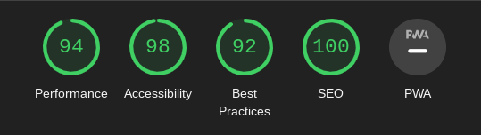

# Anime World
---
The Anime World website was built for anime fans of all ages.

It is meant to provide some current information on the top 10 highest grossing anime franchises in history but also provide meeting times for people with this particular instead to meet for a coffee or drink and discuss their favourite anime.

## Features
---
### HOME page:
---
#### Navigation:

- The logo at the top right leads to the home page
- The navigation items at the top right are links that lead to different pages and they open within the same tab.
- Signing up for the newletter on the sign up page will take you to a "Thank you" page.
- There are a lot of pictures because of the nature of the website.
- The logo font is meant to resemble a game-like style.

#### The header:

- shows the logo and the navigation links
- provides the user with what the page is about (Top 10)

#### The Top 10 section:

- provides information on the top 10 highest grossing anime franchises ever and their net worth along with pictures.

#### The times section:

- this section has all the different meeting times throughout the month that are arrange for the users of the website to meet and discuss the favourite anime. 

#### Social media section:

- this section includes social media icons in order for users to be able to find the Anime World pages on Facebook, Instagram, Twitter and YouTube.

### GALLERY page:
---
- It simply includes all the pictures shown on the website without any obstacles. 

### SIGN UP page:
---
- It includes a form where users can sign up if they want to receive newsletter from the website. 
- signing up will take the user to a "Thank you" page.
- the fonts are the same throughout all 3 pages and the colours on this page in particular are based off of the picture used.

## Testing
---
- Tested on browsers: Chrome and Edge
- I tested for responsiveness on all standard screen sizes using devtools.
- All text is readable and easy to understand
- The form functions correctly, requires input on all fields and the email field requires an email address. The submit button also works.

## Bugs

This has not been deployed to GitHub Pages yet but I will test it more when I do have it deployed.
I believe I have used absolute file paths so that may present a problem.

## Validator Testing

- HTML:
    - error about the "initial-scale" attribute found in the meta element. This was part of the template, perhaps it needs updating.
    - error on Gallery and SignUp pages about not using any divs.

- CSS:
    - No errors were found when passing through the official (Jigsaw) validator

- Accessibility:
    - The colours and fonts are easy to read and have passed the lighthouse devtools test

    

## Unfixed Bugs

No unfixed bugs

## Deployment
---
- The site was deployed to GitHub pages. The steps to deploy are as follows:
    - In the GitHub repository, navigate to the Settings tab
    - From the left-hand side menu, find and click on the Pages tab
    - Choose a branch you want to deploy from (e.g main)
    - Click save and wait a few minutes for your page to be deployed.
    - Refresh the page to view the link for your page. 

## Credits
---
### Content
- Code was taken and inspired from the [Love Running](https://github.com/otherworldly94b/love-running) project for a lot of this current project.
- The biggest similarities should be in social media links, the "times" section and the Gallery page.
- The signup page should also have similarities but the code for it was written by me in the Love Running project as well.
- Some CSS code was also inspired from the [Love Running](https://github.com/otherworldly94b/love-running) project.

### Media
- All images were taken from the web and links to their origin  will be provided below.
    - [Pokemon](https://www.imdb.com/title/tt0168366/)
    - [Anpanman](https://myanimelist.net/anime/1960/Sore_Ike_Anpanman)
    - [Hello Kitty](https://en.wikipedia.org/wiki/Hello_Kitty)
    - [Dragon Ball](https://www.imdb.com/title/tt0088509/)
    - [Yu-Gi-Oh!](https://www.imdb.com/title/tt0249327/)
    - [Fist of the North Star](https://en.wikipedia.org/wiki/Fist_of_the_North_Star)
    - [Sailor Moon](https://www.imdb.com/title/tt0114327/)
    - [Neon Genesis Evangelion](https://www.imdb.com/title/tt0112159/)
    - [One Piece](https://www.imdb.com/title/tt0388629/)
    - [Pretty Cure](https://prettycure.fandom.com/wiki/Smile_Pretty_Cure!)
    - [We want you](https://www.pinterest.com/pin/i-need-you-for-nerv--75364993734479331/)
    - [Anime cafe](https://wallpapers.com/cafe-anime)
    - [All anime characters](https://wallpaperaccess.com/anime-all-characters-hd)